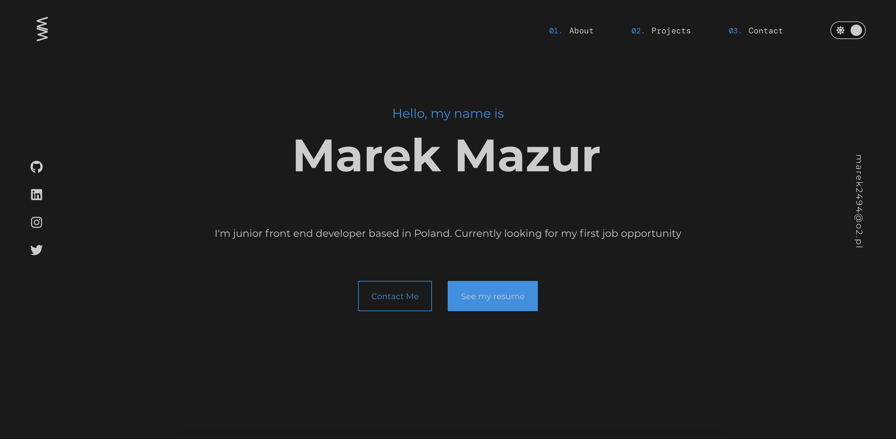

<h2 align="center">My Personal Webiste</h2>

  

 

## Live Versions 📍

  <a href="https://marek3289.netlify.app">https://marek3289.netlify.app</a>

## License

Portfolio-v1 is licensed under the <a href='https://opensource.org/licenses/mit-license.php'>MIT License.</a>